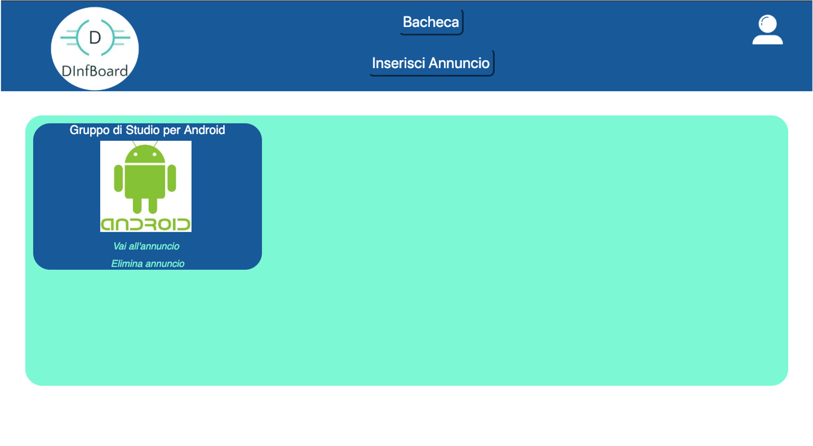
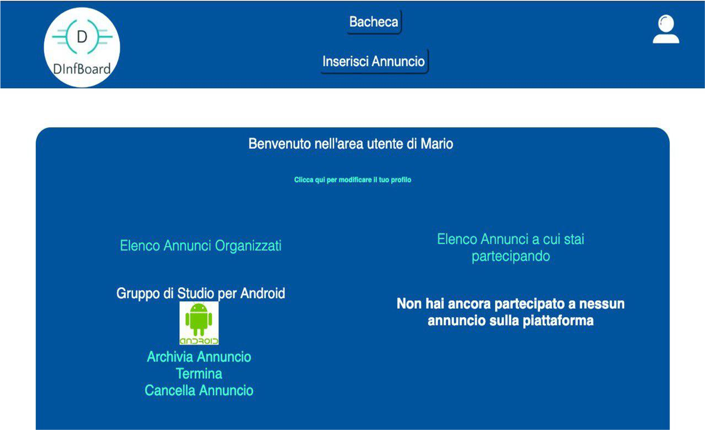
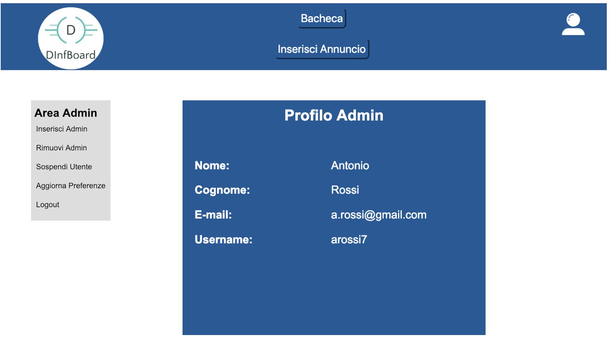
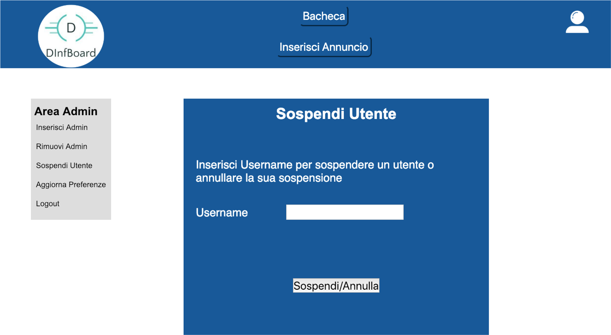

# DInfBoard
Website that provides a section to publish and organize announcements and courses training about university.

 

  
  
  
  

#### It has following packages:
1. **Control**: It contains all servlet.
2. **Web Content**: It contains jsp pages, css style, images and all scripts.
3. **Model**: It contains Beans and Model to connect to the DB (using DataSource).

 

  

